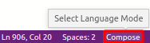

# [VSCode Generic Key-Value Syntax Highlight][1]
Turns the first word in a line into a `keyword` or a `#comment`. Also recognizes `$variables`.


## Usage
- automatic for `.conf` files
- override your current syntax highlight by choosing `Key Value` when changing file association\
    
- make it permanent in `settings.json`

  ```json
  "files.associations": {
      "*.yml": "key-value",
  }
  ```


[1]: https://marketplace.visualstudio.com/items?itemName=icetbr.vscode-generic-key-value-syntax-highlight
